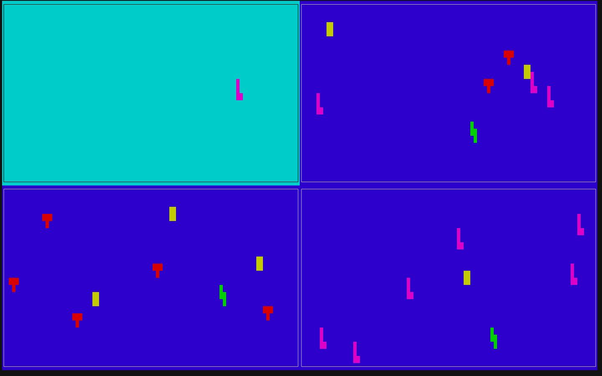

# tetris



Tetris block are falling down on the first screen. When one reaches the bottom it gets printed out on one of three other screens.

The navy blue ones are waiting (`condition_variable`) on the list of blocks that is supplied with block from the first screen.


## Build

```bash
./compile
```
