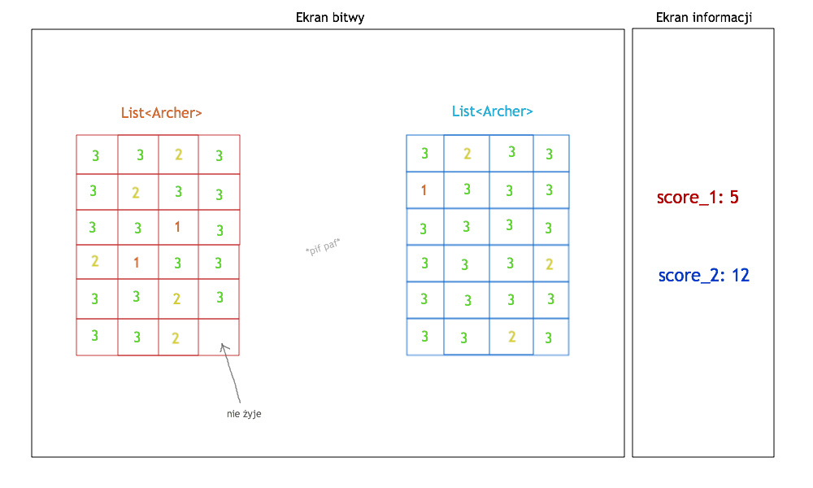

# archers-simulation





### Zasoby:

1. Ekran bitwy - łucznicy i ich HP
2. Ekran informacji - score'y
3. Lista Łuczników 1
4. Lista Łuczników 2
5. `score_1`
6. `score_2`
7. zbiór liczb losowych


### Wątki:

1. Wypisujący `score_1` na ekranie informacji - `condition_variable`/`std::atomic`, event=postrzał lub śmierć łucznika.
2. Wypisujący `score_2` na ekranie informacji.
3. Dla każdego łucznika (48 łącznie).

   Po 24 łuczników na drużynę. Łucznik trzela w losowo wybranego łucznika z drużyny przeciwnej z pewnym prawdopodobieństwem, że w niego trafi (np. 50%). Prawdopodobieństwo ustawione na sztywno lub losowane w momencie strzału.

4. Odświeżający oba ekrany.

5. Kończący grę - bada czy któraś z list łuczników jest pusta.

   Wątek nasłuchuje przy usuwaniu łuczników z list.

6. Wątek generujący liczby losowe z `/dev/urandom`.

-------------


#### Przykładowe zdarzenie w symulacji:

Łucznik z drużyny 1. strzela do losowego z łucznika z drużyny 2.

Przeciwnikowi zmniejsza się HP (domyślnie 3 HP), reprintuje się na ekranie. Dla HP==0 wymazuje przeciwnika z ekranu i usuwa go z listy łuczników 2. Leci notify dla `score_2` - wynik jest aktualizowany.

Symulacja się kończy, gdy jedna z list z list łuczników jest pusta - wygrywa bardziej żywy gracz.


-------------


#### Zarys klasy łucznika

```cpp
class Archer
{
    int health_points;
    pair<int, int> position;  // y, x
    team RED;  // enum

    void get_shot();  // zbija własne HP
    void shot_enemy(List<Archer> enemies);  // strzela do losowego przeciwnika
}
```

Łucznik będzie wyświetlany jako HP.


-------------

#### Możliwość rozszerzenia symulacji

- [ ] Na ekranie informacji można wyświetlać historię zdarzeń np. "Łucznik _losowe imię_ został postrzelony przez _imię_", "... zrobił unik".

- [ ] Łucznicy mogliby być ładniej wyświetlani - kolorowy ludzik + HP. Przy śmierci mały nagrobek/krzyż.

- [ ] Animacja utraty HP obok ofiary w momencie postrzału - pojawiające się na chwilę `-1` obok ludzika.

- [ ] Wątek kończący grę wyrzuca na ekran boxa z informacją o wygranym.

- [ ] Po zakończonej grze możliwość ponownego puszczenia symulacji.

- [ ] Dodać "*pif paf*" w losowych miejscach podczas strzału.

Wątki:

- [ ] Generator wykonujący strzał.

- [ ] Trzecia drużyna/armia w grze.
